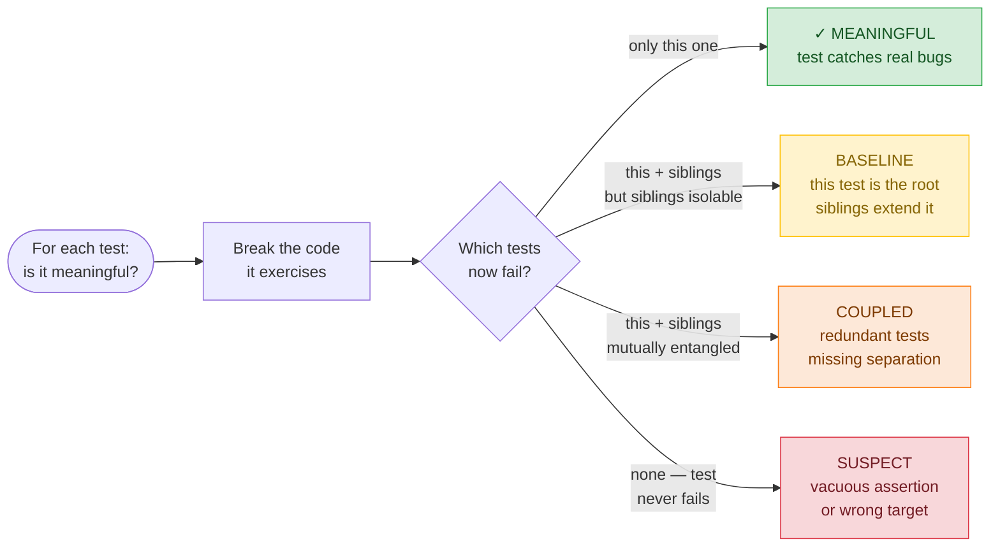
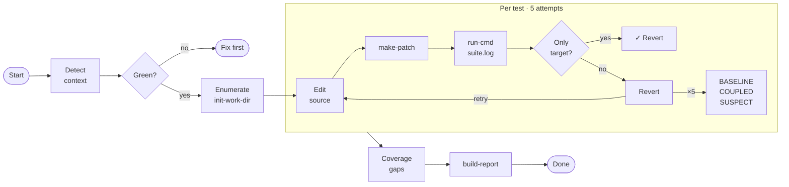

# test-meaningfulness

Mutation testing skill for Claude Code. Evaluates how meaningful each unit test is by finding a minimal source code change that causes exactly that test to fail while all others stay green.

## Concept



## Implementation flow



## Work directory

```
mutation-work/
  test-names.txt         ← written by AI with Write tool
  test-001/
    name.txt             ← from test-names.txt via init-work-dir.sh
    mutation.patch       ← from make-patch.sh
    mutation-desc.txt    ← written by AI with Write tool
    suite.log            ← from run-cmd.sh
    outcome.txt          ← OK | BASELINE | COUPLED | SUSPECT
    siblings.txt         ← (BASELINE/COUPLED only)
    role.txt             ← (BASELINE groups only) "root" | "sibling of test-NNN"
  test-002/
    ...
mutation-report.md       ← from build-report.sh
untested-areas.md        ← written by AI with Write tool
```

## Scripts

| Script | Purpose |
|--------|---------|
| `init-work-dir.sh` | Create `test-NNN/` dirs and write `name.txt` from `test-names.txt` |
| `make-patch.sh` | Capture `git diff` of current edit into a patch file |
| `run-cmd.sh` | Run any shell command, capture log, print tail + exit code |
| `build-report.sh` | Assemble markdown table from all `test-NNN/outcome.txt` files |
| `sbt-start.sh` | Start sbt persistent server (sbt projects — see `references/`) |
| `sbt-stop.sh` | Stop sbt persistent server |

## References

- [sbt usage instructions](references/sbt-instructions.md)
